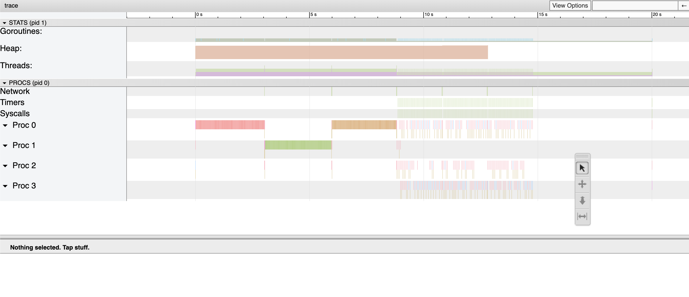
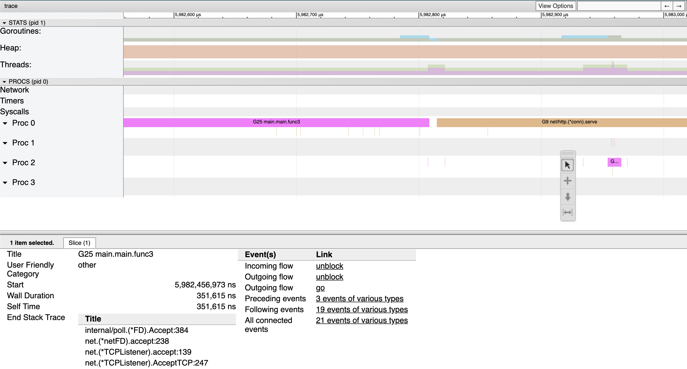
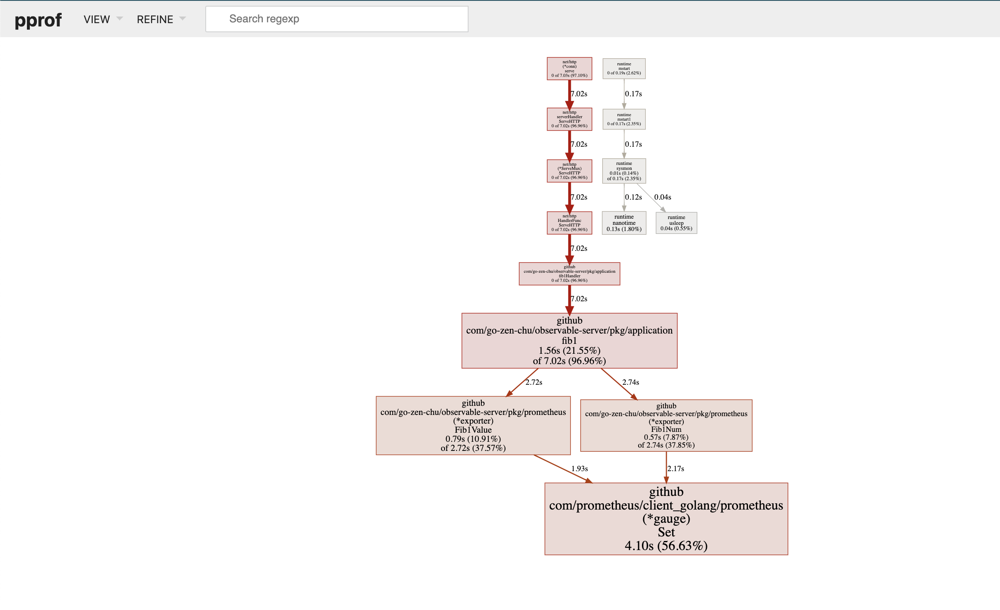
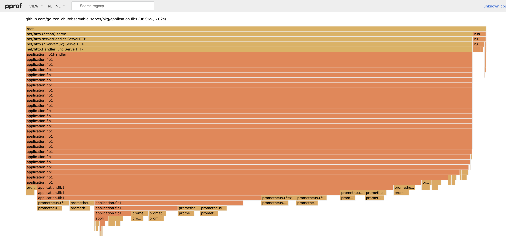
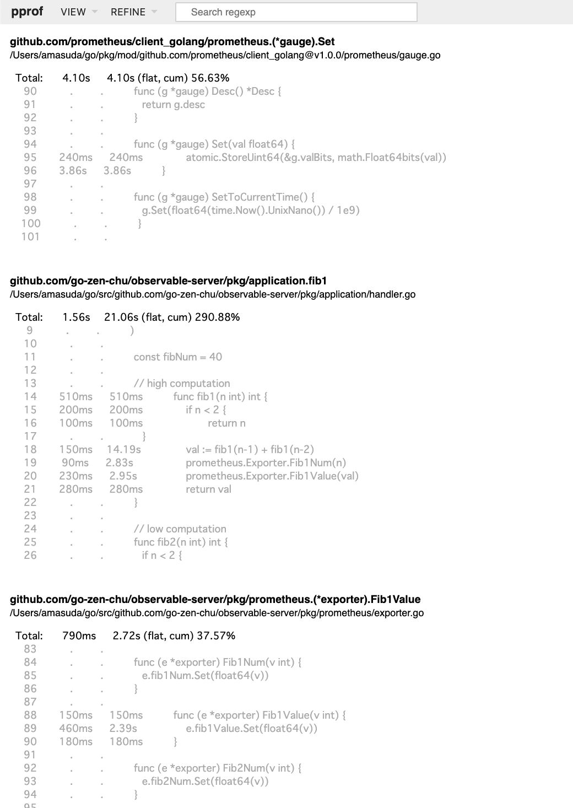

# observable-server

[](https://circleci.com/gh/go-zen-chu/observable-server)
[](http://godoc.org/github.com/go-zen-chu/observable-server)
[](https://github.com/go-zen-chu/observable-server/issues)
[](https://app.fossa.io/projects/git%2Bgithub.com%2Fgo-zen-chu%2Fobservable-server?ref=badge_shield)

Sample application of golang observable server.

## What is observable?

When you run and operate an application, it's incredibly important that we can understand what is happening with the app.

If your app is a blackbox, it is hard to troubleshoot and fix incidents when it happens.

Observability gives us a hint to know "what is happening now" which helps us recognising an issue and phenomenon correctly.

In chemics, [Green fluorescent protein - Wikipedia](https://en.wikipedia.org/wiki/Green_fluorescent_protein) is one of the greatest discovery for tracing what is happening in organism which gave big insights for biology and pharmaceutics. This is also one of the examples for observability.

## Run

```
go run main.go
```

You can check below url in your browser that it's running.
- http://localhsot:8080/fib1
- http://localhsot:8080/fib2


### Observe :telescope:

Keep running an application above and let's observe it without downtime.


#### trace

Trace provides info about *what function is performed in which thread in selected time range*.

Open pane in your terminal and run below.

```
# get trace while running function
curl "localhost:6060/debug/pprof/trace?seconds=20" > fib_trace20s & \
curl http://localhost:8080/fib1 && \
curl http://localhost:8080/fib1 && \
curl http://localhost:8080/fib1 && \
curl http://localhost:8080/fib2 && \
curl http://localhost:8080/fib2 && \
curl http://localhost:8080/fib2

# trace result
go tool trace fib_trace20s
```



By selecting short time range, you can see which function was called in the range.



reference:
- [trace - The Go Programming Language](https://golang.org/cmd/trace/)


#### profile

Profile gives info about *what function is consuming computing resource*.

Open 2 window in terminal

```
# get profile in terminal 1
go tool pprof -http=:10000 -seconds=20 http://localhost:6060

# run fib function in terminal 2
curl http://localhost:8080/fib1 && \
curl http://localhost:8080/fib1 && \
curl http://localhost:8080/fib1 && \
curl http://localhost:8080/fib2 && \
curl http://localhost:8080/fib2 && \
curl http://localhost:8080/fib2
```

*cpu consuming time graph*



*function flame graph*



*cpu consuming source code*



#### custom metrics

Trace and profile is function given by standard pprof package but in the real world application, we want to observe application specific metrics to understand what is happening in the app.

Again open 2 window in terminal and try below.

```
# get metrics in terminal 1
watch -n 0.5 "curl 'http://localhost:9090/metrics' 2> /dev/null | grep -e 'fibnum_observable' | grep -v '#'"

# run fib function in terminal 2
curl http://localhost:8080/fib1 && \
curl http://localhost:8080/fib2
```

(`brew install watch` if you are mac and watch is not installed)

You'll get a result like below.

```
# in the beggining
fibnum_observable_server_const_fib_num 40
fibnum_observable_server_fib1 0
fibnum_observable_server_fib1_value 0
fibnum_observable_server_fib2 0
fibnum_observable_server_fib2_value 0

# when fib1 is running
fibnum_observable_server_const_fib_num 40
fibnum_observable_server_fib1 2
fibnum_observable_server_fib1_value 5
fibnum_observable_server_fib2 39
fibnum_observable_server_fib2_value 6.3245986e+07

# when fib2 is running
fibnum_observable_server_const_fib_num 40
fibnum_observable_server_fib1 40
fibnum_observable_server_fib1_value 1.02334155e+08
fibnum_observable_server_fib2 30
fibnum_observable_server_fib2_value 832040

# eventually you can confirm that same result came out in both function
fibnum_observable_server_const_fib_num 40
fibnum_observable_server_fib1 40
fibnum_observable_server_fib1_value 1.02334155e+08
fibnum_observable_server_fib2 40
fibnum_observable_server_fib2_value 1.02334155e+08
```

This application imprements prometheus exporter so it's better pulling metrics from prometheus and show graph in graphana in the actual environment.


#### why not use log?

Yes, log is indeed important way to know what is happening in application.

If your organization have log analytics platform like elasticsearch, splunk or google stackdriver then output log is also a good practice to observe your application.

In my experience, depending too much on logs may cause issue like,

1. logs are much more disk consuming than metrics and easily fills up apps storage
2. if logs are unstructured, it's hard to analyse and require complex querying
3. logs are more difficult to automate action (e.g. restart or scale up) than metrics because you need to make rule

Logging is easy and powerful way to observe your app but be careful when you think you are too dependent on logging.

## License
[](https://app.fossa.io/projects/git%2Bgithub.com%2Fgo-zen-chu%2Fobservable-server?ref=badge_large)